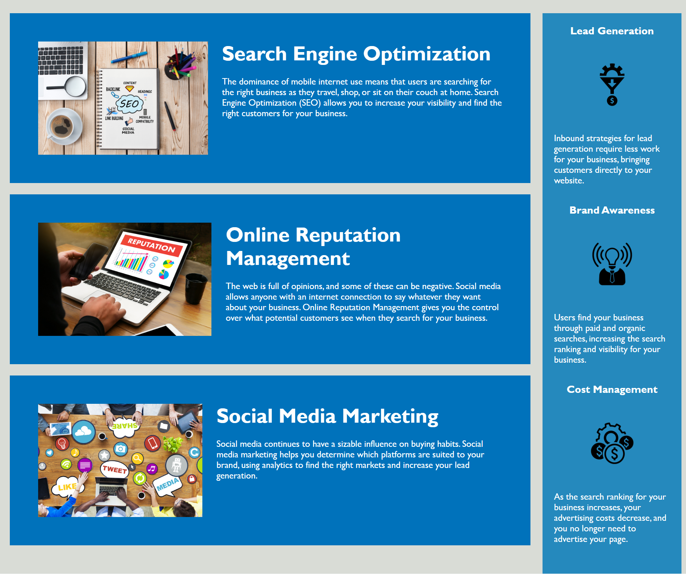

# **Refactored Code for Horiseon Webpage**

## Description

The Horiseon webpage was not running at optimal capacity. The company submitted a user story to refractor their code. I refactored their page using only HTML and CSS. Listed below are some problems that I came across when editing the code.

- There were multiple sets of classes and elements that had similar functionality, which was negatively effecting it's rending speed. To combat this, I consolidated repeat classes/elements into one bigger class and made a global variable for the main text color, thus limiting the lines of code need. 

- The HTML semantic was composed mostly of div tags. Functionally, the browser will still run fine, however, it makes the code difficult to read. To increase readability, I added various HTML tags that better described what the particular part of code was for.

- The CSS style sheet layout did not match HTML file, and did not contain any comments. Again, this just makes the code hard to read but does not affect the function. I grouped classes and ID based on the HTML layout. I've also added comments to let the user know what a particular set of code does.

- There were some issues with various links to images throughout the code and the webpage lacked accessability requirements. In the heading section, one of the navigation links were not working due to a syntax error. Lastly, the main image was being displayed using CSS instead of on the HTML file. While this method ultimately got the job done it presented challenges when trying to make the webpage more user accessible. This was quickly link properly in the HTML file. In addition, I add alt text to images to make the page more accessible.

## Images

Image was rather large displaying on both my desktop and laptop screen, so I split the same page into two screenshots.

## Credit

-University of Texas Web Development Bootcamp

-JaQwae Ellison